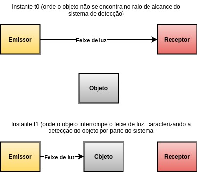
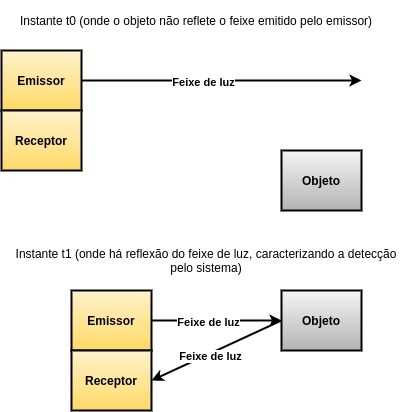
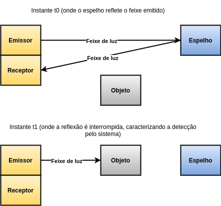

2)

**sistema por barreira**

O emissor e o receptor são desacoplados (dispostos em unidades separadas) e estão posicionados de maneira frontal a uma distância 'd'. Entre ambos há um feixe de luz, emitido pelo emissor e recebido pelo receptor de maneira contínua, e no momento em que o receptor deixa de receber tal feixe, isso caracteriza a detecção de um objeto, havendo então o acionamento da saída do sensor.

**sistema por difusão óptica**

O emissor e receptor se encontram no mesmo encapsulamento e a detecção do objeto é feita quando o receptor passa a receber a luz emitida pelo emissor por meio da reflexão desta pelo objeto detectado, nesse caso havendo o acionamento da saída.

**sistema reflexivo**

O emissor e o receptor se encontram no mesmo encapsulamento, havendo reflexão do feixe emitido pelo emissor por meio de um espelho posicionado a frente do sensor, que é recebido pelo receptor. No momento que essa recepção é interrompida (o que caracteriza a detecção), a saida do sistema é acionada.

