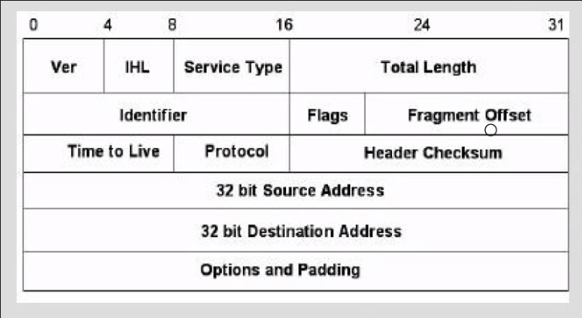

### camada de rede

**resumo**

- finalidade: transportar pacotes do host x para o host y
- estabelecimento de conexão: não se aplica para os pacotes tcp
- principais componentes: protocolo ip, roteamento e protocolo de comunicação de controle (icmp)

**repasse**

- caminho percorrido da origem ao destino (nesse ccaso o roteador só se preocupa com o proximo salto do pacote); condição de encaminhamento para o roteador seguinte
- tabela de repasse: informações sobre como a rota será escolhida

**roteamento**

- determinação da rota entre caminho e destino, de um pacote (tabela de roteamento)

**redes atm**

- entrega garantida e ordenada
- entrega de melhor esforço (em caso de falha, compensação na camada de transporte se tcp)

**redes de datagrama**

- escolha de rota com base no ip destino
- roteamento com faixa de endereços (de endereço x até y, encaminhe para o enlace z): não utilizado
- roteamento por prefixo (máscara): comparação dos prefixos com as entradas da tabela; em caso de mais de um match, o maior match de bits é escolhido

**protocolo ip**

