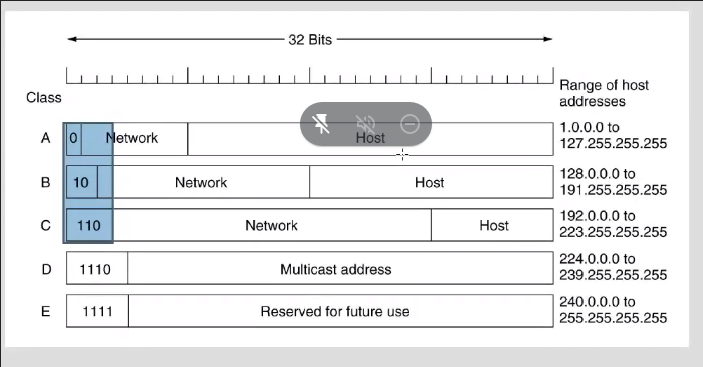
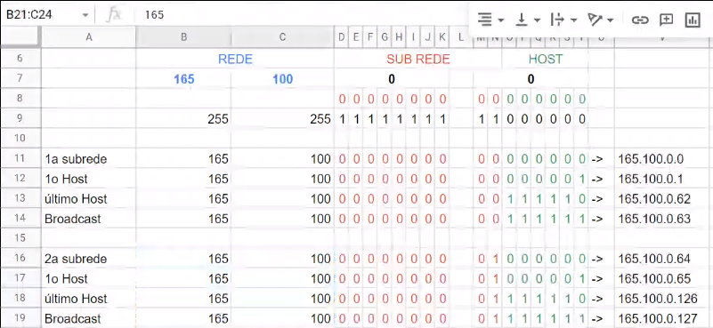

### endereçamento

**resumo**

- para cada sub-rede, o ip de broadcast e o ip da sub-rede (prefixo) são reservados
- endereço da sub-rede (prefixo) é o menor endereço do range
- endereço de broadcast é o maior endereço do range
- valor do prefixo (/X) é a quantidade de bits '1' da máscara

**exercicios**

